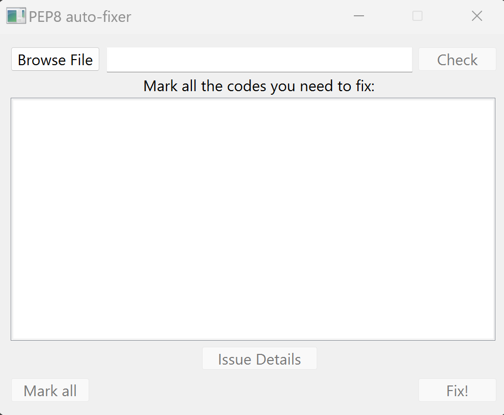
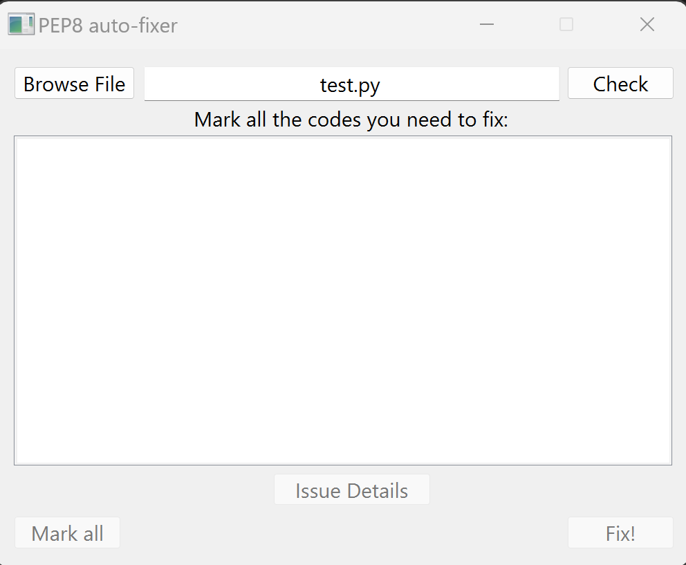
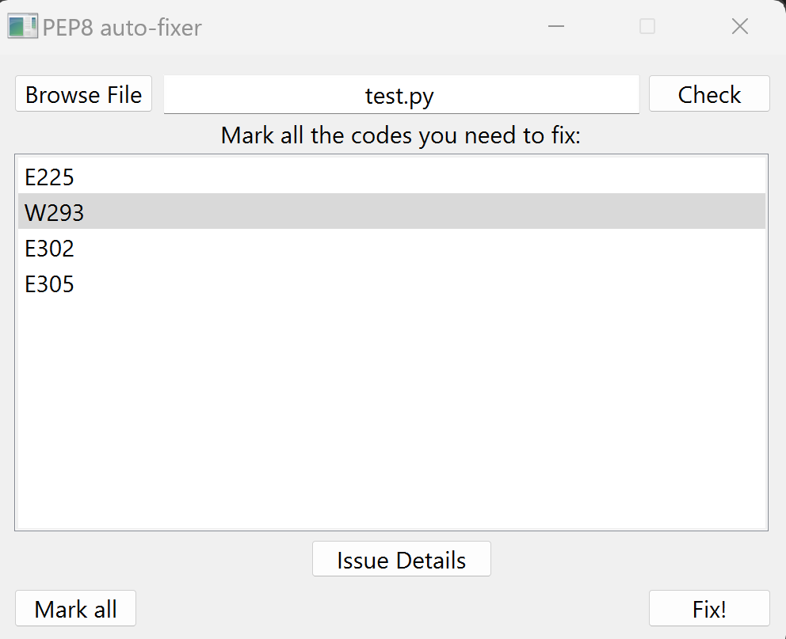
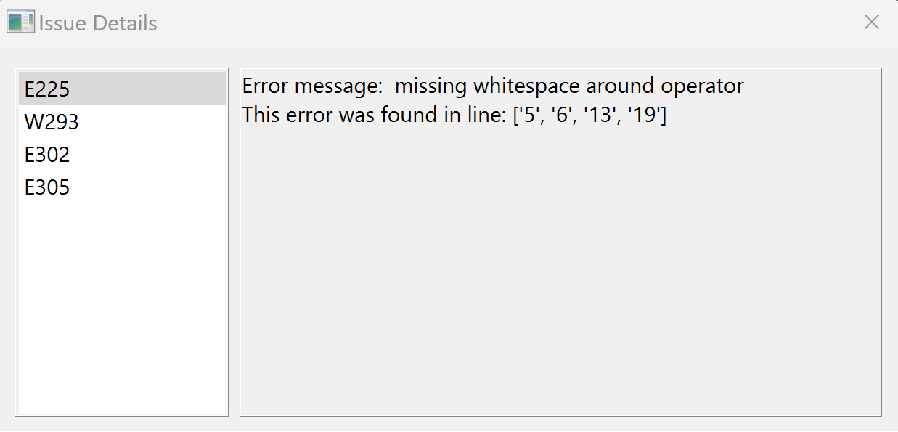

  

#
Introducing PEP8 fixer UI, your all-in-one solution for fix the pep8 issues of your python files. This user-friendly application combines the power of the autopep8 and pycodestyle libraries, providing a seamless and visually intuitive experience for cleaning up your Python code.
## Screanshots

  
  
  
  

## Key features
- Intuitive User Interface
- Custom fix (you can select what codes it will fix)
- Details about any PEP8 code
- Create a new fixed file (doesn't overwrite the original file)
- Integrated File Explorer

## Getting started
1. Download the latest [release](https://github.com/BakuKurae/pep8_fixer_tool/releases) as zip file
2. Unzip the files and execute pep8_fixer_ui.exe
3. Select the file that you want to fix
4. Click de **Check** button
5. Mark the pep8 codes to fix
6. Hit the **Fix!** button

## Contribution
PEP8 Fixer is an open-source project, and we welcome contributions from the Python community. Feel free to report issues, suggest improvements, or contribute to the development by visiting our GitHub repository.
